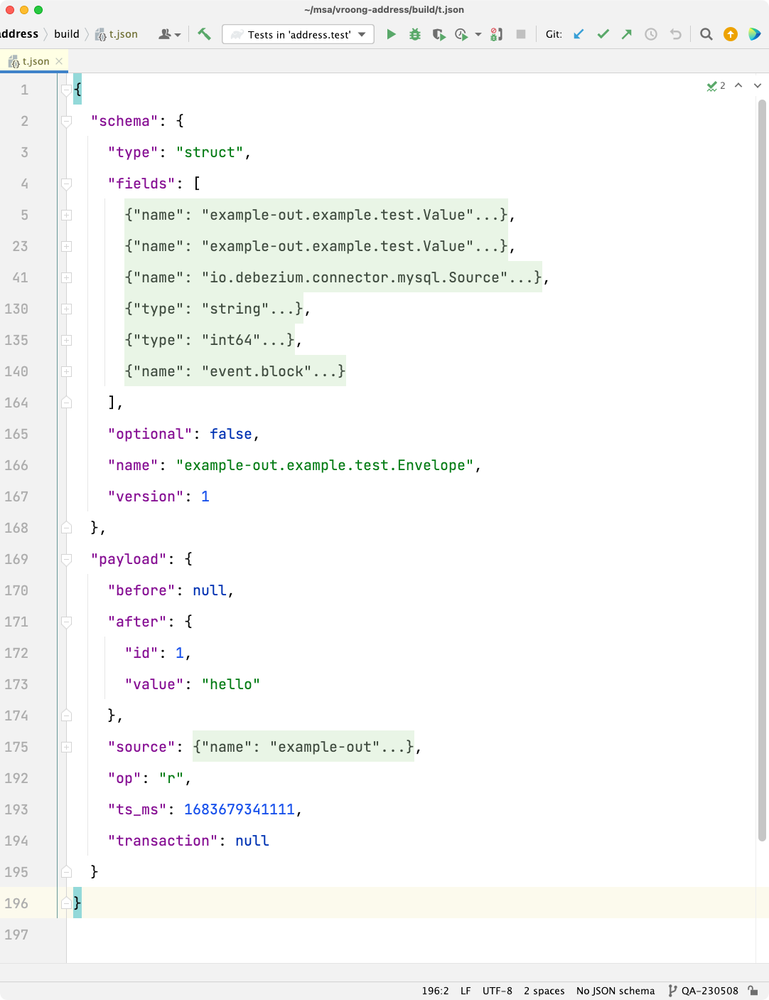

## debezium-example

### Reference

- https://debezium.io/documentation/reference/2.2/tutorial.html
- https://github.com/debezium/debezium-examples/tree/main/tutorial

### Run down

Run the stack.

```shell
docker compose -f compose-arm.yaml up
```

Create database schema.

```shell
docker exec -it mysql mysql -uroot -psecret -e 'CREATE DATABASE IF NOT EXISTS example'
```

Set up mysql-debezium-kafka connector.

```shell
curl -X POST -H 'Accept: application/json' -H 'Content-Type: application/json' localhost:8083/connectors/ -d '{
  "name": "example-connector",
  "config": {
    "connector.class": "io.debezium.connector.mysql.MySqlConnector",
    "tasks.max": "1",
    "database.hostname": "mysql",
    "database.port": "3306",
    "database.user": "root",
    "database.password": "secret",
    "database.server.id": "9999",
    "topic.prefix": "example-out",
    "schema.history.internal.kafka.bootstrap.servers": "kafka:9092",
    "schema.history.internal.kafka.topic": "schemahistory.example-schema-out"
  }
}'

// Full list of configuration properties: https://debezium.io/documentation/reference/2.2/connectors/mysql.html#_required_debezium_mysql_connector_configuration_properties
// "database.include.list": "some regex", // By default, the connector captures changes in all databases.

curl -H 'Accept: application/json' http://localhost:8083/connectors/

curl -H 'Accept: application/json' http://localhost:8083/connectors/example-connector
```

Check if the Kafka topic exists.

```shell
docker exec -it kafka kafka-topics --bootstrap-server localhost:9092 --list
```

Subscribe to the Kafka topic.

```shell
docker exec -it kafka kafka-console-consumer --bootstrap-server localhost:9092 --topic example-out.{SCHEMA}.{TABLE} --from-beginning
```

Do some DDL, DML at MySQL client and check if the messages are received via the topic.

```shell
docker exec -it mysql bash
mysql -uroot -p
mysql> ...
```

### Message Schema

DB Schema



